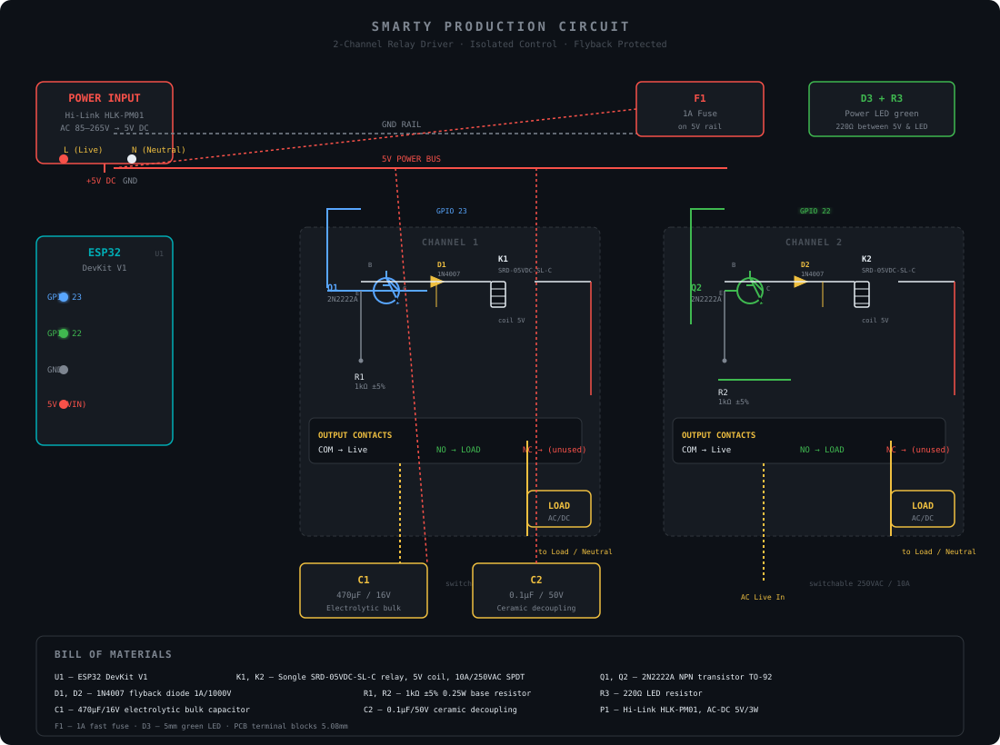

<div align="center">

# Smarty

### ESP32 Cloud Command Center

Control ESP32 relays remotely through Firebase Realtime Database.

[](https://github.com/ammar0xff/Smarty/actions/workflows/ci.yml)


</div>

---

## What is this?

A web dashboard that sends commands to ESP32 microcontrollers via Firebase Realtime Database. Click a button on the web, the ESP32 activates a relay — simple as that.

```
Web Dashboard  →  Firebase RTDB  →  ESP32 subscribes  →  Relay ON/OFF
```

## Quick Start

### 1. Clone and install

```bash
git clone https://github.com/ammar0xff/Smarty.git
cd smarty
npm install
```

### 2. Configure Firebase

```bash
cp .env.example .env.local
```

Edit `.env.local` with your Firebase project credentials:

```
VITE_FIREBASE_API_KEY=your_api_key
VITE_FIREBASE_DATABASE_URL=https://your-project-default-rtdb.us-central1.firebasedatabase.app
VITE_FIREBASE_PROJECT_ID=your_project_id
```

### 3. Run

```bash
npm run dev
```

Open **http://localhost:5173** — click a button, the ESP32 relay activates.

## Circuit Diagram



### Control wiring (logic side)

| ESP32 Pin | Component | Signal |
|-----------|-----------|--------|
| GPIO 23   | R1 → Q1 base   | Relay 1 trigger (`press1`) |
| GPIO 22   | R2 → Q2 base   | Relay 2 trigger (`press2`) |
| GND       | Q1/Q2 emitter | Ground rail |
| 5V (VIN)  | K1/K2 coil, D1/D2 | 5V power rail |

### Power / output wiring (load side)

| From | To | Note |
|------|----|------|
| AC Live | Relay COM (both) | switched wire |
| Relay NO | Load (L1, L2) | load returns to Neutral |
| Hi-Link HLK-PM01 | 5V bus + GND | isolated AC-DC supply |
| F1 (1A) | between 5V & VIN | fuse protection |

### Production component notes

- **Relays** — Songle `SRD-05VDC-SL-C`: 5V coil, SPDT, rated **10A @ 250VAC**. Use the **NO** contact to switch the live wire only; never switch neutral.
- **Transistors** — `2N2222A` NPN: the ESP32's 3.3V GPIO **cannot** drive a 5V relay coil directly. The transistor inverts/switches the ~72mA coil current; coil resistance ~70Ω.
- **Flyback diodes** — `1N4007` **across the coil** (cathode to 5V, anode to collector) — required to clamp the inductive spike when the coil de-energizes, otherwise Q1/Q2 die instantly.
- **Base resistors** — `1kΩ` limit GPIO current to ~2.3mA (safe for the ESP32's ~40mA max per pin). Confirms the 5V logic level.
- **Power supply** — Hi-Link `HLK-PM01` (AC 85–265V → 5V DC, isolated). Do **not** power relays from the ESP32's on-board 3.3V regulator — it cannot source the coil current.
- **Decoupling** — `470µF` electrolytic bulk + `0.1µF` ceramic on the 5V rail to absorb coil switching transients and prevent brownouts.

### Using 12V relays instead

The bill of materials above is specified for a 5V coil on a 5V rail. A 12V relay
module on a 12V supply works with the same 2N2222A switching stage, but three
things must change, and skipping them produces exactly the "sometimes it works"
symptom:

- **Decoupling is not optional.** A 12V coil has roughly 4x the inductance and dumps
  a far larger transient into the rail. Fit `470µF` + `100nF` at the relay end even
  if nothing seemed wrong at 5V, or the ESP32 brownouts mid-stream.
- **Keep the flyback diode.** Cathode to 12V+, anode to the collector. A reversed
  diode destroys the transistor on the first switch-off, which presents as a relay
  that works a few times and then goes dead.
- **Do not assume the 2N2222A pinout.** E-B-C ordering varies by manufacturer and
  package. Verify each device against its own datasheet; swapping the two
  transistors is a fast way to tell a driver fault from a wiring fault.

Base drive is unaffected: 3.3V through `1kΩ` still gives ~2.6mA, which saturates a
typical 12V/36mA coil easily. Do not lower that resistor.

## ESP32 Setup

Install the current Firebase Arduino client library (`FirebaseClient` v2.x, by
Firebase) and subscribe to the relay paths.

### Command format

`sendCommand()` does not write a bare number. It writes an **object**:

```json
{ "value": 1, "timestamp": 1758000000000 }
```

so the firmware must parse JSON and read `value`.

Do **not** acknowledge a command by writing back to the same node. The write races
the stream and any command that has been written but not yet delivered gets
overwritten and silently lost; at six commands 200 ms apart this dropped 4 of 6.
Deduplicate on `timestamp` instead — it survives reconnect replays and, stored in
NVS, survives a reboot.

The firmware writes `0` back to `/pressN/value` about a second after firing, so
the dashboard shows a visible pulse rather than a latched `1`. That reset is
deliberately written to the **child** path `/pressN/value` instead of the whole
object: rewriting the whole node from a callback replaces it and destroys the
`timestamp` that deduplication depends on. The reset is abandoned if a newer
command arrives before it fires.

### Security

The web app uses no Firebase Authentication, so the Realtime Database must be
readable and writable by anyone. That is fine for a bench test but means
**anyone who knows the database URL can energise your relays**. Put it behind a
non-guessable path, add Auth, or keep it off the public internet before leaving
it unattended.

```cpp
/**
 * Smarty — ESP32 firmware for https://github.com/ammar0xff/smarty
 *
 * Contract with the web dashboard (src/firebase.ts):
 *   sendCommand(path) -> set(ref(db, "press1"), { value: 1, timestamp: serverTimestamp() })
 * so each relay node is an OBJECT, not a bare int.
 *
 * No Firebase auth: requires open RTDB rules
 *   { "rules": { ".read": true, ".write": true } }
 *
 * Threading: the stream callback runs on a FreeRTOS task and must not block.
 * Everything with a delay in it (relay pulse, cosmetic value reset, NVS write)
 * is deferred to loop() and driven by the flags set in processData().
 */
#define ENABLE_DATABASE
#define ENABLE_USER_AUTH
#include <FirebaseClient.h>
#include <ArduinoJson.h>
#include <WiFi.h>
#include <Preferences.h>
#include <ArduinoOTA.h>
#include <ExampleFunctions.h>  // defines SSL_CLIENT for the platform

// WiFi
#define WIFI_SSID "your-wifi-ssid"
#define WIFI_PASSWORD "your-wifi-password"

// Must be the *.firebasedatabase.app host, not the legacy firebaseio.com:
// firebaseio.com serves a *.us-central1.firebasedatabase.app certificate, so
// hostname verification fails -> "Failed to initialize the SSL layer".
#define DATABASE_URL "your-project-default-rtdb.region.firebasedatabase.app"

// --- Relay topology ---------------------------------------------------------
// Adding a relay is a one-line change here: the count, the pin and the RTDB
// path all follow from this table. Per-relay state, NVS keys and the value
// reset path are derived from the index, so nothing else needs editing.
constexpr uint8_t RELAY_COUNT = 2;

struct RelayConfig {
  uint8_t pin;          // ESP32 output driving this relay's transistor
  const char *path;     // RTDB node the dashboard writes to
};

constexpr RelayConfig RELAYS[RELAY_COUNT] = {
    {23, "/press1"},
    {22, "/press2"},
};

// How long the contacts are held closed.
constexpr unsigned long PULSE_MS = 500;

// How long the database value stays 1 before being reset to 0, measured from the
// moment the command arrived. The dashboard never reads this back, so the reset
// is purely cosmetic -- which is exactly why it must not be able to lose a click.
constexpr unsigned long RESET_DELAY_MS = 1000;

constexpr unsigned long WIFI_CONNECT_TIMEOUT_MS = 30000;
constexpr unsigned long WIFI_RETRY_INTERVAL_MS = 2000;
constexpr unsigned long HEAP_LOG_MS = 15000;

// --- Firebase objects -------------------------------------------------------
SSL_CLIENT ssl_client, stream_ssl_client;
using AsyncClient = AsyncClientClass;
AsyncClient aClient(ssl_client);        // writes
AsyncClient streamClient(stream_ssl_client);  // the SSE stream

NoAuth no_auth;
FirebaseApp app;
RealtimeDatabase Database;

// --- Per-relay runtime state ------------------------------------------------
struct RelayState {
  // Last accepted command stamp. Timestamps come from the dashboard's
  // serverTimestamp(), so they are Unix milliseconds -- about 1.8e12, which does
  // NOT fit in a 32-bit long. Truncating it wrapped the value negative roughly
  // half the time, which silently disabled deduplication.
  long long lastStamp = -1;

  // Cosmetic reset, pending for one second after the command arrived.
  long long resetStamp = -1;  // which stamp the reset belongs to
  unsigned long resetAt = 0;  // millis() deadline
  bool resetPending = false;

  // NVS writes can block for tens of milliseconds. Doing them in the stream
  // callback stalls the stream and RTDB starts dropping events, so the write is
  // deferred to loop() via this flag.
  bool stampDirty = false;
};

RelayState relays[RELAY_COUNT];

// Pulse state, kept out of RelayState because a pulse is shared: overlapping
// clicks are queued in pendingMask and fired one after another.
uint8_t pendingMask = 0;   // clicks waiting to fire, bit0 = relay 1
uint8_t onMask = 0;        // relays currently driven HIGH
unsigned long onSince = 0;

// Connectivity
unsigned long wifiDownMs = 0;
bool streamFault = false;  // raised by the stream task, handled in loop()
bool firebaseReady = false;

unsigned long heapMs = 0;

// --- Small helpers ----------------------------------------------------------

// Wrap-safe "has this millis() deadline passed". millis() wraps every ~49 days
// and a plain >= comparison breaks across the wrap; the signed difference does not.
bool deadlinePassed(unsigned long now, unsigned long deadline) {
  return (long)(now - deadline) >= 0;
}

// NVS key for a relay's dedup stamp. Kept as s1/s2 so existing stored stamps
// stay valid -- changing the scheme would make a reboot replay a seen command.
void stampKey(uint8_t idx, char *out, size_t n) {
  snprintf(out, n, "s%u", (unsigned)idx + 1);
}

// NVS keeps the dedup stamps across a reboot (or a brownout, which this board is
// prone to) so a stale command still sitting in the database cannot replay.
Preferences prefs;

void loadStamps() {
  prefs.begin("smarty", true);
  char key[8];
  for (uint8_t i = 0; i < RELAY_COUNT; i++) {
    stampKey(i, key, sizeof key);
    relays[i].lastStamp = prefs.getLong64(key, -1);
  }
  prefs.end();
}

void saveStamp(uint8_t idx, long long stamp) {
  prefs.begin("smarty", false);
  char key[8];
  stampKey(idx, key, sizeof key);
  prefs.putLong64(key, stamp);
  prefs.end();
}

void flushStamps() {
  for (uint8_t i = 0; i < RELAY_COUNT; i++) {
    if (!relays[i].stampDirty) continue;
    relays[i].stampDirty = false;
    saveStamp(i, relays[i].lastStamp);
  }
}

// Returns the relay a command path belongs to, or -1 if we do not own it.
int8_t relayIndexFor(const String &path) {
  for (uint8_t i = 0; i < RELAY_COUNT; i++) {
    if (path == RELAYS[i].path) return i;
  }
  return -1;
}

// --- Contact pulse ----------------------------------------------------------

void startPulse(uint8_t mask) {
  onMask = mask;
  onSince = millis();
  for (uint8_t i = 0; i < RELAY_COUNT; i++) {
    if (onMask & (1 << i)) digitalWrite(RELAYS[i].pin, HIGH);
  }
  // Generic over RELAY_COUNT while keeping the exact "relay1=1 relay2=0 ON"
  // shape the test scripts and any log scraper match on.
  for (uint8_t i = 0; i < RELAY_COUNT; i++) {
    Firebase.printf("relay%d=%d%c", i + 1, !!(onMask & (1 << i)), ' ');
  }
  Firebase.printf("ON\n");
}

void servicePulse() {
  if (onMask && deadlinePassed(millis(), onSince + PULSE_MS)) {
    for (uint8_t i = 0; i < RELAY_COUNT; i++) digitalWrite(RELAYS[i].pin, LOW);
    onMask = 0;
  }
  if (pendingMask && !onMask) {
    uint8_t m = pendingMask;
    pendingMask = 0;
    startPulse(m);
  }
}

// --- Cosmetic value reset ---------------------------------------------------
// Queued here, written from loop(): never from the stream callback, because the
// write can block and a delay() in the callback stalls the SSE stream.
void scheduleReset(uint8_t idx, long long stamp) {
  relays[idx].resetStamp = stamp;
  relays[idx].resetAt = millis() + RESET_DELAY_MS;
  relays[idx].resetPending = true;
}

void serviceResets() {
  // One reset per iteration keeps each write a discrete RTDB event instead of a
  // burst, which is what used to overrun the stream.
  for (uint8_t i = 0; i < RELAY_COUNT; i++) {
    RelayState &r = relays[i];
    if (!r.resetPending || onMask || pendingMask) continue;  // never mid-pulse
    if (!deadlinePassed(millis(), r.resetAt)) continue;       // hold at 1
    r.resetPending = false;

    // A newer command has since arrived; that one owns the value now.
    if (r.resetStamp >= 0 && r.lastStamp != r.resetStamp) continue;

    // Write the value child, not the whole node: this merges and leaves the
    // timestamp intact. (Building one object with two writer.create() calls
    // replaces it instead, producing {timestamp} with no value.)
    char path[24];
    snprintf(path, sizeof path, "%s/value", RELAYS[i].path);
    if (!Database.set(aClient, path, 0)) Firebase.printf("reset %s failed\n", path);
  }
}

// --- Command parsing --------------------------------------------------------

// Read the numeric "value" out of the dashboard's command object. Returns false
// when the payload is not an object with an integer value -- which is also how
// keep-alive events and unrelated nodes are discarded.
//
// Out-params rather than a returned struct: the Arduino CLI injects generated
// prototypes immediately after the last #include, so a user-defined type in a
// signature would not be declared yet at that point.
bool parseCommand(const char *json, int &value, long long &stamp) {
  JsonDocument doc;
  if (deserializeJson(doc, json) != DeserializationError::Ok) return false;
  JsonVariant v = doc["value"].as<JsonVariant>();
  if (v.isNull() || !v.is<int>()) return false;
  value = v.as<int>();
  stamp = -1;
  JsonVariant t = doc["timestamp"].as<JsonVariant>();
  if (!t.isNull() && t.is<long long>()) stamp = t.as<long long>();
  return true;
}

// --- Stream callback --------------------------------------------------------
// Runs on the stream task. No delays, no NVS writes, no RTDB writes in here.

void processData(AsyncResult &aResult) {
  if (!aResult.isResult()) return;

  if (aResult.isError()) {
    // -118 is the cancellation we trigger ourselves when recycling the stream.
    if (aResult.error().code() != -118) {
      Firebase.printf("Error task: %s, msg: %s, code: %d\n",
                      aResult.uid().c_str(), aResult.error().message().c_str(),
                      aResult.error().code());
      streamFault = true;  // loop() rebuilds the stream
    }
    return;
  }
  if (!aResult.available()) return;

  RealtimeDatabaseResult &stream = aResult.to<RealtimeDatabaseResult>();
  if (!stream.isStream()) return;
  if (stream.type() != realtime_database_data_type_json) return;  // command object

  String path = stream.dataPath();
  int8_t idx = relayIndexFor(path);
  if (idx < 0) return;

  int value = 0;
  long long stamp = -1;
  if (!parseCommand(stream.to<const char *>(), value, stamp)) return;

  RelayState &r = relays[idx];

  // Idempotency: the dashboard stamps every command with serverTimestamp(), so a
  // reconnect snapshot replays the same stamp. Acting on it again would fire the
  // relay twice for one click.
  if (stamp >= 0) {
    if (stamp == r.lastStamp) return;  // replay of a command already seen
    r.lastStamp = stamp;
    r.stampDirty = true;  // written from loop(), not here
    r.resetPending = false;  // this command supersedes any pending reset
  }

  Firebase.printf("cmd %s value=%d stamp=%lld\n", path.c_str(), value, stamp);

  // No ack write-back: the dashboard never reads these values, and writing to
  // the same path could overwrite a command the stream had not delivered yet.
  if (value != 1) return;

  pendingMask |= (1 << idx);
  scheduleReset(idx, stamp);
}

// --- Connectivity -----------------------------------------------------------

// A single stream on "/" so dataPath() is absolute (/press1, /press2).
// With a per-node stream the path is relative and arrives as "/".
// No SSE filter is set: with one in place the library's event filtering was found
// to stop delivering commands, and a missed click is far worse than a quiet
// stream we cannot distinguish from a healthy idle one.
void startStream() {
  Database.get(streamClient, "/", processData, true /* SSE mode */, "streamTask");
}

// The library has no stream retry, so a socket that dies silently never
// recovers. Stop the old task first: a second get() would open a second stream
// and deliver every command twice, firing the relays twice.
void restartStream() {
  Firebase.printf("stream restart\n");
  streamClient.stopAsync(true);
  delay(250);
  startStream();
  streamFault = false;
}

// Bind the app and open the stream. Called at boot and again after any outage,
// so a dropped link is recovered without a power cycle.
void initFirebase() {
  ssl_client.setInsecure();
  stream_ssl_client.setInsecure();
  initializeApp(aClient, app, getAuth(no_auth));
  app.getApp<RealtimeDatabase>(Database);
  Database.url(DATABASE_URL);
  startStream();
}

// There is no reconnect in the boot path, so a link drop left the board
// permanently offline until it was power cycled. A dropped WiFi socket also kills
// the Firebase session with it, so the app is re-bound on recovery.
void serviceWifi() {
  if (WiFi.status() != WL_CONNECTED) {
    if (!wifiDownMs) wifiDownMs = millis();
    if (!firebaseReady && deadlinePassed(millis(), wifiDownMs + WIFI_RETRY_INTERVAL_MS)) {
      WiFi.disconnect();
      WiFi.begin(WIFI_SSID, WIFI_PASSWORD);
      wifiDownMs = millis();
    }
    return;
  }

  if (wifiDownMs) {
    Firebase.printf("wifi lost for %lus, recovered\n", (millis() - wifiDownMs) / 1000);
    wifiDownMs = 0;
  }
  if (!firebaseReady) {
    Firebase.printf("firebase re-binding\n");
    initFirebase();
    firebaseReady = true;
  }
}

// --- Entry points -----------------------------------------------------------

void setup() {
  Serial.begin(115200);

  for (uint8_t i = 0; i < RELAY_COUNT; i++) {
    pinMode(RELAYS[i].pin, OUTPUT);
    digitalWrite(RELAYS[i].pin, LOW);
  }

  loadStamps();

  Serial.printf("connecting to %s\n", WIFI_SSID);
  WiFi.begin(WIFI_SSID, WIFI_PASSWORD);
  // Bound the wait. An unreachable access point used to leave the board here
  // forever printing dots, so it never reached Firebase and never logged why.
  // serviceWifi() keeps retrying the association afterwards.
  unsigned long t0 = millis();
  while (WiFi.status() != WL_CONNECTED && !deadlinePassed(millis(), t0 + WIFI_CONNECT_TIMEOUT_MS)) {
    delay(250);
  }
  if (WiFi.status() != WL_CONNECTED) {
    Firebase.printf("no wifi after %lus (status %d), continuing - loop() will retry\n",
                    WIFI_CONNECT_TIMEOUT_MS / 1000, (int)WiFi.status());
  } else {
    Firebase.printf("connected: %s\n", WiFi.localIP().toString().c_str());
  }
  Firebase.printf("Smarty firmware, FirebaseClient v%s\n\n", FIREBASE_CLIENT_VERSION);

  ArduinoOTA.setHostname("smarty-relay");
  ArduinoOTA.setPassword("change-me");
  ArduinoOTA.begin();

  initFirebase();
  firebaseReady = true;
}

void loop() {
  ArduinoOTA.handle();

  serviceWifi();
  if (firebaseReady) app.loop();  // maintains auth + async tasks

  // Recovery is driven by the error the stream task reports rather than by a
  // keep-alive timeout, for the reason given on startStream().
  if (firebaseReady && streamFault) restartStream();

  flushStamps();
  servicePulse();
  serviceResets();

  if (deadlinePassed(millis(), heapMs + HEAP_LOG_MS)) {
    heapMs = millis();
    Serial.printf("heap: %u free / %u max block\n",
                  (unsigned)ESP.getFreeHeap(), (unsigned)ESP.getMaxAllocHeap());
  }
}
```

### Do not set an SSE filter

`Database.setSSEFilters("put,keep-alive")` looks like a tidy way to get a
liveness signal, and it does deliver keep-alive events — but with it in place
commands stopped arriving and the board needed a power cycle to recover. Stream
recovery is therefore driven by the error the stream task reports, not by a
keep-alive timeout. Losing a click matters more than knowing a quiet stream is
dead.

`FirebaseClient` has no stream retry of its own, so `restartStream()` stops the
old task before opening a new one; a second concurrent `get()` would deliver
every command twice and fire the relays twice.

## Adding More Relays

Edit `src/main.ts` and add a new entry to the `RELAYS` array:

```typescript
const RELAYS: Relay[] = [
  { id: 1, label: "Relay 1", description: "LED light control", path: "press1" },
  { id: 2, label: "Relay 2", description: "Secondary relay", path: "press2" },
  { id: 3, label: "Relay 3", description: "Door lock", path: "press3" },
]
```

The dashboard automatically renders cards for all relays in the array.

On the firmware side, adding a relay is a single entry in the `RELAYS` table —
per-relay state, the NVS key and the `/pressN/value` reset path are all derived
from it:

```cpp
constexpr uint8_t RELAY_COUNT = 3;

constexpr RelayConfig RELAYS[RELAY_COUNT] = {
    {23, "/press1"},
    {22, "/press2"},
    {26, "/press3"},
};
```

Bump `RELAY_COUNT` in the same edit. Nothing else needs changing.

Two things to watch if you do this:

- **Pin choice.** Avoid 34–39; they are input-only and have no output driver.
- **NVS keys are positional.** A relay's dedup stamp is stored under `s1`, `s2`,
  ... by index, so inserting a relay in the middle of the table re-points the
  stored stamps at different relays and a reboot could replay a seen command.
  Append new relays at the end.

## Commands

| Command | Description |
|---|---|
| `npm run dev` | Start dev server |
| `npm run build` | Production build to `dist/` |
| `npm run preview` | Preview production build |
| `npm run type-check` | TypeScript type checking |

## Tech Stack

| | |
|---|---|
| Build | Vite 6 |
| Language | TypeScript 5 |
| Firebase | v11 (modular SDK) |
| Hosting | GitHub Pages |

## License

[MIT](./LICENSE)
